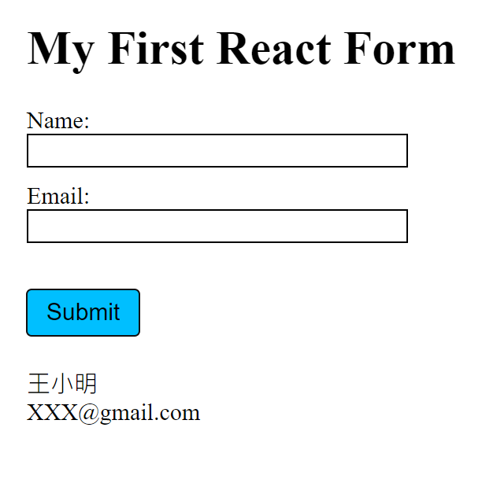

## My First React Form

使用 React 及 Node.js 製作

### 頁面呈現



### 功能

- 輸入姓名&信箱
- 列印出輸入內容

## 如何使用

1. 安裝 Node.js 及 npm
2. clone 專案到本地 3.在本地開啟後，透過終端機進入資料夾，輸入：

```bash
npm install
```

4. 安裝完畢，繼續輸入:

```bash
npm start
```

5. 若成功運行，則會看到底下訊息，可複製網址至瀏覽器查看：

```bash
Compiled successfully!

You can now view first_react_form in the browser.

  Local:            http://localhost:3000
  On Your Network:  http://172.20.10.2:3000

Note that the development build is not optimized.
To create a production build, use npm run build.

webpack compiled successfully
```

6. 要停止時則按 ：

```bash
ctrl + c
```

## 開發工具

- Node.js
- React 18.2.0
